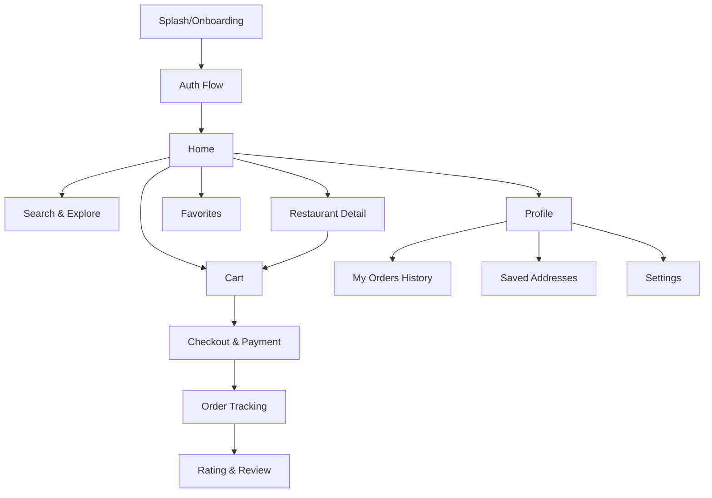
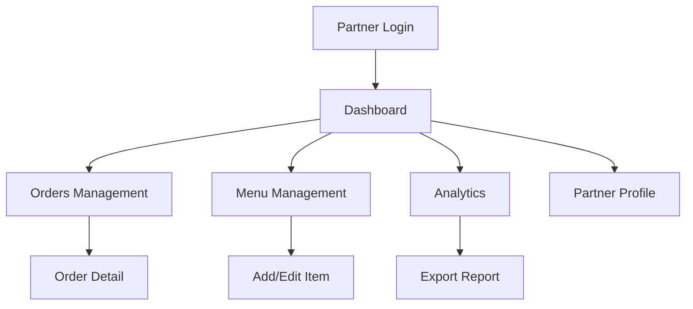
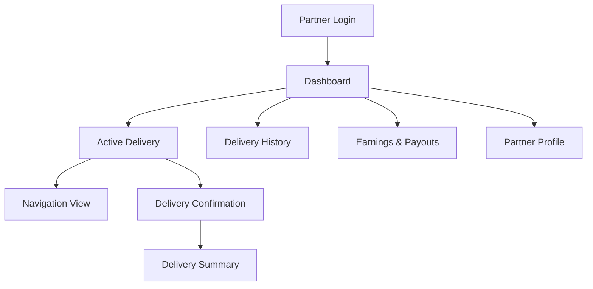

# Chizze — Food Delivery App Design System & UI/UX Specification

> **Stitch MCP Project ID:** `12145144984613853990`
> **Architecture:** Flutter (Frontend) + Go (Backend) + Appwrite (BaaS)
> **Apps:** Customer App · Restaurant Partner App · Delivery Partner App

---

## 1. Design System Foundation

### 1.1 Brand Identity

| Property | Value |
|---|---|
| **App Name** | Chizze |
| **Tagline** | "Delicious food, delivered fast" |
| **Logo Style** | Bold modern wordmark, Plus Jakarta Sans Extra Bold |
| **Brand Personality** | Premium, fast, trustworthy, vibrant |

### 1.2 Color Palette

```
Primary:
  - Orange (Brand):       #F49D25  — CTAs, active states, branding
  - Deep Orange:          #E8751A  — Hover/pressed states
  - Orange Gradient:      linear-gradient(135deg, #F49D25, #E8751A)

Background (Dark Theme):
  - Surface BG:           #0D0D0D  — Main background
  - Card BG:              #1A1A1A  — Card/container surfaces
  - Elevated Surface:     #252525  — Modals, FABs, elevated cards
  - Glass Effect:         rgba(255,255,255,0.06) with backdrop-blur(20px)

Text:
  - Primary Text:         #FFFFFF
  - Secondary Text:       #A0A0A0
  - Tertiary/Hint:        #666666

Semantic:
  - Success/Earnings:     #22C55E  — Confirmations, online status, money
  - Error/Reject:         #EF4444  — Errors, decline, out-of-stock
  - Warning/Instructions: #FACC15  — Special notes, highlights
  - Info/Navigation:      #3B82F6  — Links, map routes
  - Rating Star:          #FBBF24  — Star ratings

Veg/Non-Veg Indicators:
  - Veg:                  #22C55E (green square border with dot)
  - Non-Veg:              #EF4444 (red square border with dot)
```

### 1.3 Typography

| Level | Font | Weight | Size | Use |
|---|---|---|---|---|
| H1 | Plus Jakarta Sans | 800 (ExtraBold) | 28sp | Screen titles, hero numbers |
| H2 | Plus Jakarta Sans | 700 (Bold) | 22sp | Section headers |
| H3 | Plus Jakarta Sans | 600 (SemiBold) | 18sp | Card titles, restaurant names |
| Body1 | Plus Jakarta Sans | 500 (Medium) | 16sp | Primary body text |
| Body2 | Plus Jakarta Sans | 400 (Regular) | 14sp | Secondary text, descriptions |
| Caption | Plus Jakarta Sans | 400 (Regular) | 12sp | Labels, metadata, badges |
| Button | Plus Jakarta Sans | 600 (SemiBold) | 16sp | Button text |
| Price | Plus Jakarta Sans | 700 (Bold) | 16sp | Prices, amounts |

### 1.4 Spacing & Sizing

```
Spacing Scale: 4, 8, 12, 16, 20, 24, 32, 40, 48, 64 dp
Border Radius: 8dp (cards), 12dp (buttons/inputs), 16dp (modals), 24dp (bottom sheets), 999dp (pills/chips)
Icon Size: 20dp (inline), 24dp (nav/action), 32dp (feature icons), 48dp (category icons)
Avatar Size: 32dp (inline), 40dp (list), 48dp (cards), 80dp (profile)
Touch Target Minimum: 48dp × 48dp
```

### 1.5 Glassmorphism Cards

```
Background:    rgba(255, 255, 255, 0.06)
Border:        1px solid rgba(255, 255, 255, 0.1)
Backdrop-blur: 20px
Border-radius: 16dp
Shadow:        0 8px 32px rgba(0, 0, 0, 0.3)
```

### 1.6 Elevation & Shadows

| Level | Shadow | Use |
|---|---|---|
| Level 0 | none | Flat cards |
| Level 1 | `0 2px 8px rgba(0,0,0,0.2)` | Cards, list items |
| Level 2 | `0 4px 16px rgba(0,0,0,0.3)` | Floating cards, modals |
| Level 3 | `0 8px 32px rgba(0,0,0,0.4)` | Bottom sheets, sticky bars |

### 1.7 Animations & Transitions

```
Duration:
  - Micro:    150ms  — Button press, toggle, icon change
  - Short:    250ms  — Card appear, chip select
  - Medium:   350ms  — Page transitions, panel slide
  - Long:     500ms  — Modal overlay, skeleton shimmer

Curves:
  - Standard: cubic-bezier(0.4, 0.0, 0.2, 1)  — Most transitions
  - Decelerate: cubic-bezier(0.0, 0.0, 0.2, 1)  — Enter/slide-in
  - Accelerate: cubic-bezier(0.4, 0.0, 1, 1)  — Exit/slide-out

Micro-animations:
  - Skeleton shimmer loading for all content areas
  - Pulse animation on notification badges
  - Scale-down 0.95 on button press
  - Bounce on add-to-cart
  - Lottie animations for: empty states, order success, delivery arrived
  - Progress dot animation on order tracking status bar
  - Countdown ring animation on delivery partner accept/decline
```

---

## 2. Component Library

### 2.1 Buttons

| Type | Style | Use |
|---|---|---|
| Primary Filled | Orange bg (#F49D25), white text, 12dp radius, 48dp height | Place Order, Sign Up, Accept |
| Secondary Outlined | Transparent bg, white 1.5px border, white text | Log In, Cancel, Decline |
| Tertiary/Text | No bg/border, orange text | "Add more items", "View all" |
| Icon Button | 40dp circle, semi-transparent bg | Call, Chat, Share, Favorite |
| FAB | 56dp circle, orange bg, white icon | Add New Item |
| Chip/Tag | Pill shape, 32dp height, semi-transparent bg | Cuisine filters, diet types |
| Toggle Switch | 52×28dp, green (#22C55E) active, gray inactive | Online/Offline, Availability |

### 2.2 Input Fields

```
Height:         48dp
Background:     #1A1A1A
Border:         1px solid rgba(255,255,255,0.1)
Border-radius:  12dp
Focus border:   #F49D25
Placeholder:    #666666 text
Text:           #FFFFFF
Prefix icon:    #A0A0A0 (24dp)
```

### 2.3 Cards

| Type | Description |
|---|---|
| **Restaurant Card** | Image (16:9), overlay gradient bottom, name, rating stars, delivery time, distance, cuisine, price for two, promoted badge |
| **Food Item Card** | Horizontal: image left (80dp square rounded), name + description, veg/non-veg icon, price, ADD button right |
| **Order Card** | Order ID, restaurant, items summary, timestamp, total, status badge, action buttons |
| **Metric Card** | Glassmorphism, icon + label top, large number center, trend indicator bottom |
| **Delivery Request Card** | Elevated, restaurant name, distance info, earnings, countdown timer, Accept/Decline |

### 2.4 Bottom Navigation Bar

```
Height:          72dp (+ safe area)
Background:      #1A1A1A
Border-top:      1px solid rgba(255,255,255,0.05)
Active icon:     #F49D25, filled variant
Inactive icon:   #666666, outline variant
Active label:    #F49D25, 11sp caption
Badge:           8dp red circle or count badge
```

**Customer App Tabs:** Home, Search, Cart, Favorites, Profile
**Restaurant Partner Tabs:** Dashboard, Orders, Menu, Analytics, Profile
**Delivery Partner Tabs:** Home, Deliveries, Earnings, Profile

### 2.5 Status Badges

| Status | Color | Use |
|---|---|---|
| New / Pending | `#3B82F6` blue | New orders |
| Preparing | `#F49D25` orange | In-progress |
| Ready | `#22C55E` green | Ready for pickup |
| Delivered | `#22C55E` green | Completed |
| Cancelled | `#EF4444` red | Cancelled orders |
| Promoted | `#FBBF24` gold | Featured restaurants |
| Bestseller | `#FBBF24` gold outline badge | Top items |

---

## 3. Customer App Screens

### 3.1 Onboarding / Welcome
>
> **Stitch Screen ID:** `5da4adfe451247a190ac774e0605b985`

**Layout:**

- Full-screen background: high-quality food photography with warm gradient overlay (top transparent → bottom #0D0D0D)
- Center-top: "Chizze" logo wordmark in white ExtraBold 36sp
- Below logo: tagline "Delicious food, delivered fast" in white Medium 16sp
- Bottom half: glassmorphism card containing:
  - "Sign Up" primary filled button (full width)
  - "Log In" outlined button (full width)
  - Divider with "or continue with"
  - Social login row: Google, Apple, Phone icons (48dp circle each)
- Bottom: "Terms & Privacy Policy" link in caption gray

**States:** Default, Social login loading, Error toast

**User Flow:**

```
Onboarding → Sign Up → Phone OTP → Set Name → Set Location → Home
Onboarding → Log In → Phone/Email → OTP/Password → Home
Onboarding → Social Login → Auto-fill profile → Set Location → Home
```

### 3.2 Home / Discovery
>
> **Stitch Screen ID:** `5e46da992a094d54b9b19d375961208d`

**Layout (Scrollable):**

1. **Header (sticky):** "Hey, {name}!" H2, address selector pill (pin icon + "Home" + dropdown arrow), notification bell with red count badge, profile avatar 32dp
2. **Search Bar:** 48dp, magnifying glass icon, "Search restaurants, cuisines, dishes..." placeholder, voice mic icon right
3. **Promo Carousel:** Horizontal PageView, 16:9 ratio cards, auto-scroll 5s, page indicator dots, content: offer image + title + CTA button
4. **Category Chips Row:** Horizontal scroll, circular icon (48dp) + label below, categories: Pizza, Burger, Biryani, Chinese, Desserts, Healthy, Thali, South Indian, Rolls, Ice Cream
5. **"Top Picks For You" Section:** H2 header + "See All" link, vertical list of restaurant cards:
   - Each card: 16:9 image, gradient overlay bottom with restaurant name H3, star icon + rating + review count, clock icon + delivery time, rupee icon + price for two, cuisine tags, promoted/featured gold badge if applicable
6. **"Popular Near You" Section:** H2 header, horizontal scroll of compact restaurant cards (square image, name, rating, time)
7. **"Offers For You" Section:** Horizontal scroll of offer banners
8. **Bottom Nav:** 5-tab navigation

**States:** Loading (skeleton shimmer), Empty (no restaurants nearby), Location permission prompt, Pull-to-refresh

**Interactions:**

- Tap restaurant card → Restaurant Detail screen
- Tap search bar → Search screen with keyboard
- Tap category chip → Filtered restaurant list
- Tap notification bell → Notifications screen
- Tap address → Address selector bottom sheet
- Pull down → Refresh content

### 3.3 Search & Explore
>
> **Stitch Screen ID:** `e420c747f1074835bb9d7bb52f01d54b`

**Layout:**

1. **Search Bar (auto-focused):** Text input with voice icon and filter icon, real-time suggestions dropdown as user types
2. **Recent Searches:** Clock icon + search term, "Clear All" link top-right, max 5 items
3. **Trending Searches:** Tag chips with trend-up icon, dynamically updated
4. **Browse by Cuisine:** 4-column grid of circular icons with labels: Indian, Italian, Chinese, Mexican, Thai, Japanese, Continental, Street Food
5. **Browse by Diet:** Horizontal chips: Vegan 🌱, Keto 🥩, Gluten-Free 🌾, Jain ☸
6. **Popular Dishes:** Horizontal scroll cards: dish image (square 120dp), dish name, restaurant name in caption, price range
7. **Search Results (when typing):** Mixed results — restaurants, dishes, cuisines with section headers

**Filter Bottom Sheet:**

- Sort By: Relevance, Rating, Delivery Time, Cost (Low to High / High to Low)
- Cuisine multi-select checkboxes
- Rating: 4.0+, 3.5+, Any
- Quick filters: Pure Veg, Offers, Free Delivery
- Distance slider: 1km - 15km
- Apply + Reset buttons

### 3.4 Restaurant Detail / Menu
>
> **Stitch Screen ID:** `91470d5b8baa4dcdbf182de3449e061c`

**Layout:**

1. **Hero Banner (280dp):** Restaurant cover photo, gradient overlay, back arrow top-left, share + favorite heart top-right
2. **Info Card (floating, overlapping hero by 40dp):** Glassmorphism card with:
   - Restaurant name H2
   - Star rating + "4.3" + "(2.1K ratings)" link
   - Cuisine tags: "North Indian · Chinese · Biryani"
   - Row: clock "25-30 min" | distance "2.1 km" | rupee "₹300 for two"
3. **Offer Banner:** Orange gradient strip, coupon text + "APPLY" button
4. **Tab Bar (sticky on scroll):** Menu (default active), Reviews, Photos, Info
5. **Menu Section:**
   - Left sidebar (optional/header): Category list vertically scrollable, active category in orange
   - Category header with item count
   - Food item rows:
     - Left: veg/non-veg icon, name (H3), description (Body2, 2-line max), price (Bold), bestseller/must-try badge
     - Right: dish image (80dp rounded 8dp), "ADD" orange button below image
   - "ADD" button → customization bottom sheet if applicable
6. **Sticky Bottom Cart Bar (when items added):** "{N} items | ₹{total}" + "View Cart →" button

**Item Customization Bottom Sheet:**

- Item name + image + base price
- Size: Regular / Large (radio)
- Add-ons checkboxes: Extra Cheese +₹30, Extra Gravy +₹20
- Spice level: Mild / Medium / Spicy (segmented)
- Special instructions text input
- Quantity selector (+/-)
- "Add to Cart — ₹{total}" button

### 3.5 Cart & Checkout
>
> **Stitch Screen ID:** `f626ca0081644155a166f1f96526cf30`

**Layout (Scrollable):**

1. **Header:** Back arrow, "Cart" title, restaurant name subtitle with "Add more items +" link
2. **Cart Items List:** Each item:
   - Veg/non-veg icon + name + customization details (gray caption)
   - Quantity selector: − [count] + (outlined style)
   - Price (right-aligned)
   - Swipe-left to remove (red delete)
3. **Cooking Instructions:** Text input "Any special requests?"
4. **Apply Coupon Section:** Coupon icon + "Apply Coupon" → bottom sheet with:
   - Search/input code
   - Available coupons list: code badge, description, T&C expandable, "APPLY" button
5. **Delivery Instructions:** Toggle chips: "Leave at door", "Call on arrival", "No contact delivery"
6. **Tip Section:** "Tip your delivery partner" + amount chips: ₹20, ₹30, ₹50, Custom
7. **Bill Details Card:** Glassmorphism card with breakdown table:
   - Item Total
   - Delivery Fee (with "FREE" in green if applicable)
   - Platform Fee (with info icon)
   - Taxes & GST
   - Discount (green, negative amount)
   - **Grand Total (highlighted, large)**
8. **Payment Method:** Selected method with change option → Payment selector bottom sheet:
   - UPI (Google Pay, PhonePe, Paytm)
   - Credit/Debit Cards (saved cards + add new)
   - Wallets
   - Cash on Delivery
9. **Sticky Bottom:** "Place Order — ₹{total}" primary button (full width)

### 3.6 Live Order Tracking
>
> **Stitch Screen ID:** `d0bef655e35b47d58de3f07d85816480`

**Layout:**

1. **Status Progress Bar (sticky top):** 4 steps with connecting line:
   - Order Placed ✓ → Preparing (animated dots) → Out for Delivery → Delivered
   - Active step: orange filled circle + bold label
   - Completed step: green check
   - Upcoming: gray outline
2. **Live Map (40% screen):** Dark mode map tiles, restaurant pin (orange), delivery location pin (green), rider animated dot (orange pulse), route polyline (blue-to-orange gradient), auto-follow rider mode
3. **ETA Card (floating over map):** Glassmorphism, "Arriving in {X} mins" H2, live countdown, rider icon
4. **Delivery Partner Card:** Photo (48dp), name, rating stars, vehicle type, "Call" + "Chat" icon buttons (orange)
5. **Order Summary (collapsible):** Chevron to expand, restaurant name, order ID, items list, total
6. **Action Row:** "Share Live Location" button, "Help" link, "Cancel Order" link (conditionally visible)
7. **Post-Delivery:** Rating screen overlay: star rating for food, star rating for delivery, photo upload, text review, tip adjustment

### 3.7 User Profile & Settings
>
> **Stitch Screen ID:** `510b4913620b4dca846650b44ab63def`

**Layout (Scrollable):**

1. **Profile Header:** Avatar (80dp) with camera edit overlay, name H2, email + phone caption, "Chizze Gold" membership badge (gold gradient)
2. **Saved Addresses:** Glassmorphism cards for Home/Work/Other, address text, edit/delete icons, "+ Add New Address" button
3. **Payment Methods:** Card icons + masked numbers, "Add Payment Method" link
4. **My Orders:** Recent 3 orders as compact cards: restaurant, date, items count, total, status badge, "Reorder" + "Rate" buttons
5. **Favorites:** Grid preview of favorited restaurants (3 visible) + "View All" link
6. **Settings List:**
   - Notifications (toggle)
   - Language selector
   - Appearance: Dark/Light/System
   - Dietary Preferences / Allergen Alerts
7. **Refer & Earn Banner:** Vibrant gradient card, gift icon, "Invite friends, earn ₹100" + "Share" button
8. **Footer Links:** Help & Support, About Chizze, Rate Us, Logout (red text)

---

## 4. Restaurant Partner App Screens

### 4.1 Partner Dashboard
>
> **Stitch Screen ID:** `24fd04a3b632400dad277e1b3c029c11`

**Layout:**

1. **Header:** Restaurant name + logo, Online/Offline toggle (green glow when online), notification bell
2. **Metrics Row:** 3 glassmorphism cards: Today's Revenue (₹ amount + trend arrow), Orders count, Avg Rating (stars)
3. **Active Orders Section:** Scrollable order cards:
   - New orders: orange border-left, Order ID, customer name, items, time elapsed, Accept (green) / Reject (red) buttons
   - Preparing: blue border-left, countdown timer, "Mark Ready" (orange) button
   - Ready: green border-left, waiting indicator, delivery partner ETA
4. **Revenue Trend Chart:** Bar chart with Daily/Weekly/Monthly toggle, glassmorphism container
5. **Quick Actions Grid:** 2×2 grid icons: Menu Management, Offers & Promotions, Reviews, Analytics
6. **Performance Metrics:** Avg Prep Time, Acceptance Rate %, Cancellation Rate %
7. **Bottom Nav:** 5-tab partner navigation

### 4.2 Menu Management
>
> **Stitch Screen ID:** `33e240e79b32400ea3f7e05c505ccccc`

**Layout:**

1. **Header:** "Menu Management" title, orange FAB "+" (Add New Item)
2. **Category Tabs:** Horizontal scroll: All, Starters, Main Course, Biryani, Desserts, Beverages
3. **Menu Items List:** Each item card:
   - Thumbnail (60dp square), name, price (editable on tap), veg/non-veg badge
   - Availability toggle (green In Stock / red Out of Stock)
   - Bestseller badge (gold)
   - Edit (pencil) + Delete (trash) icon buttons
4. **Bulk Actions Bar (sticky bottom):** "Mark All Available", "Update Prices"
5. **Add/Edit Item Form (modal/screen):**
   - Image upload with camera/gallery picker
   - Name, Description, Price inputs
   - Category dropdown
   - Veg/Non-veg selector
   - Customization options builder (size, add-ons, spice)
   - "Save" primary button

### 4.3 Orders Management
>
> **Stitch Screen ID:** `172711ee4f1b4dde8fe3a6acc621d7dc`

**Layout:**

1. **Tab Bar:** New (badge count), Preparing (badge), Ready (badge), Completed
2. **New Orders Tab:**
   - Order cards with: ID, customer avatar + name, items with quantities, total, time since placed
   - Special instructions highlighted in yellow box
   - "Accept" (green, large) + "Reject" (red, small) buttons
   - Sound notification indicator (wave icon)
3. **Preparing Tab:**
   - Same card info + elapsed timer
   - "Mark Ready" orange button
   - Estimated completion countdown
4. **Ready Tab:**
   - Waiting for pickup indicator
   - Delivery partner info + ETA
5. **Completed Tab:**
   - Past orders list, rating from customer if available
6. **Daily Summary Bar (bottom):** "Today: {N} Orders | ₹{amount}"

### 4.4 Analytics & Reports
>
> **Stitch Screen ID:** `d8f76ed03eae4022860c8cc0b1ee9b3d`

**Layout:**

1. **Date Selector:** Segmented: Today, This Week, This Month, Custom date picker
2. **Revenue Hero Card:** Large amount, % change with green/red trend arrow
3. **Orders Overview:** Total Orders, Avg Order Value, Peak Hour badges
4. **Revenue Trend Line Chart:** Gradient fill, interactive tooltips on data points
5. **Order Distribution Pie Chart:** By cuisine/category, legend below
6. **Top Selling Items:** Ranked list with horizontal bar indicators showing relative popularity
7. **Customer Insights:** New vs Returning ratio donut chart, avg rating trend sparkline
8. **Peak Hours Heatmap:** Grid (7 days × 24 hours), intensity color (gray → orange → red)
9. **Comparison Cards:** This period vs Last period side-by-side metrics
10. **Export Button:** "Export Report" → PDF/CSV/Email options

---

## 5. Delivery Partner App Screens

### 5.1 Partner Dashboard
>
> **Stitch Screen ID:** `5ead89a4977b4f9b9608e79e333aa9da`

**Layout:**

1. **Header:** Profile photo (40dp), name, Online/Offline toggle with green animated pulse
2. **Earnings Summary Card:** Glassmorphism, "Today's Earnings ₹{amount}", trips count, hours online, tips earned
3. **Delivery Request Overlay (when new order):** Elevated card:
   - Restaurant name + cuisine
   - Pickup distance + delivery distance
   - Estimated earnings "₹65"
   - 30-second circular countdown timer (orange ring depleting)
   - "Accept" (large green button, fills width)
   - "Decline" (small red text link)
4. **Background Map:** Dark mode, heat zones overlay showing surge/demand areas (orange-red gradient blobs)
5. **Weekly Goal Progress:** "₹8,200 / ₹15,000 weekly goal" with animated progress bar in green
6. **Bottom Nav:** 4-tab delivery partner navigation

### 5.2 Active Delivery / Navigation
>
> **Stitch Screen ID:** `b84d65d946424eb8bdc82895e3cf6d2d`

**Layout:**

1. **Full-Screen Map:** Dark mode, route polyline (blue → orange gradient), current location (animated blue dot), restaurant pin (orange marker), customer pin (green marker)
2. **Top Floating Card:** Glass effect, current stage label "Heading to Restaurant" / "Heading to Customer", distance + ETA
3. **Bottom Sliding Panel (draggable):**
   - Order ID + restaurant name
   - Items list with quantities
   - Customer name + address
   - Special instructions (yellow highlight box)
   - Trip earnings visible
4. **Stage Action Buttons (full width, changes per stage):**
   - Stage 1: "Arrived at Restaurant" (orange)
   - Stage 2: "Picked Up Order" (orange)
   - Stage 3: "Arrived at Customer" (orange)
   - Stage 4: "Delivered" (green) → triggers completion + earnings summary
5. **Quick Action FABs (floating right edge):**
   - 📞 Call Restaurant / Customer (context-dependent)
   - 🗺 Open in Google Maps
   - ⚠️ Report Issue

### 5.3 Earnings & Payouts
>
> **Stitch Screen ID:** `320b338bca584758bb7aeee41ac588c9`

**Layout:**

1. **Period Selector:** Segmented tabs: Today, This Week, This Month
2. **Earnings Hero Card:** "Total: ₹12,450" H1, breakdown: Base Pay, Tips, Incentives (stacked bar mini-chart)
3. **Daily Earnings Bar Chart:** Mon-Sun bars, green color, amount label on each bar
4. **Trip History List:** Each trip card:
   - Restaurant name → Customer area
   - Distance, time, completion timestamp
   - Earning amount (right, green)
   - Tip amount if applicable (highlighted)
5. **Incentives Section:** Glassmorphism card:
   - Active incentive: "Peak Hour Bonus +₹50/delivery" with clock icon
   - Surge alert: "Rain Surge 1.5x" with weather icon
   - Progress incentive: "Complete 5 more trips for ₹200 bonus" + progress bar
6. **Payout Details:**
   - Next payout date
   - Bank account (masked: XXXX-1234)
   - Payout history list (date + amount)
7. **Summary Stats:** Total trips, total km, online hours, avg ₹/hour

---

## 6. Shared Screens & Components

### 6.1 Authentication Flow

```
Screens:
  1. Welcome/Onboarding (already designed)
  2. Phone Input → Enter phone number with country code picker
  3. OTP Verification → 6-digit OTP input (auto-read), resend timer, "Verify" button
  4. Profile Setup → Name, email, profile photo upload
  5. Location Permission → Map preview, "Allow Location" button, manual address input fallback
  6. Role Selection (for partner apps) → "I'm a Restaurant Owner" / "I'm a Delivery Partner"
```

### 6.2 Notifications Screen

```
Layout:
  - Tab filter: All, Orders, Offers, Updates
  - Notification cards: icon (colored by type) + title + body + timestamp + unread dot
  - Swipe-to-dismiss, mark all read
  - Empty state: bell illustration + "No notifications yet"
```

### 6.3 Address Management

```
Components:
  - Map view with draggable pin for precision
  - Search bar with Google Places autocomplete
  - Address form: House/Flat, Floor, Landmark, Label (Home/Work/Other/Custom)
  - "Save Address" button
  - Saved addresses list with edit/delete/set-default
```

### 6.4 Rating & Review

```
Post-Delivery Rating Screen:
  - Overall star rating (1-5, large tappable stars)
  - Tag chips: "Great Food", "Fast Delivery", "Polite Rider", "Well Packed"
  - Separate delivery partner rating
  - Photo upload for food
  - Text review input
  - "Submit" button
  - Skip option
```

### 6.5 Help & Support

```
Screens:
  - FAQ categories: Orders, Payments, Account, Partners
  - FAQ detail with expandable answers
  - Live Chat (in-app messaging UI)
  - Call Support button
  - Report Issue form with order selector + category + description + image upload
```

### 6.6 Empty States & Error States

```
Every list/content area must have:
  - Skeleton shimmer loading (use shimmer animation on gray rectangles)
  - Empty state: themed illustration + title + description + action button
  - Error state: retry button + error illustration
  - No internet: offline illustration + "Retry" button

Example empty states:
  - No restaurants: "😢 No restaurants in your area yet"
  - Empty cart: "🛒 Your cart is empty — start ordering!"
  - No orders: "📦 No past orders yet"
  - No favorites: "❤️ Save your favorites for quick access"
  - No notifications: "🔔 You're all caught up!"
```

---

## 7. Navigation Architecture

### 7.1 Customer App



### 7.2 Restaurant Partner App



### 7.3 Delivery Partner App



---

## 8. Platform Support

```
Mobile (Primary & Only Platform):
  Android:  360-428dp width  — Full mobile-first design
  iOS:      375-430dp width  — Same design, iOS-specific adaptations

Minimum OS:
  Android: 8.0 (API 26)
  iOS: 15.0
```

**Rules:**

- Bottom navigation for all apps
- Bottom sheets for all modals/filters
- Full-width cards always
- Map views optimized for mobile screen sizes
- No web or desktop builds

---

## 9. Accessibility Requirements

- **Contrast ratio:** Minimum 4.5:1 for body text, 3:1 for large text
- **Touch targets:** Minimum 48×48dp
- **Screen reader support:** All images have alt text, all buttons have semantic labels
- **Color not sole indicator:** Use icons + text alongside color for status
- **Font scaling:** Support system font size up to 200%
- **Motion:** Respect `prefers-reduced-motion` — disable non-essential animations
- **RTL support:** Layout mirroring for Arabic/Hebrew locales

---

## 10. Stitch MCP Screen Reference

| # | Screen | App | Stitch Screen ID |
|---|---|---|---|
| 1 | Onboarding / Welcome | Customer | `5da4adfe451247a190ac774e0605b985` |
| 2 | Home / Discovery | Customer | `5e46da992a094d54b9b19d375961208d` |
| 3 | Search & Explore | Customer | `e420c747f1074835bb9d7bb52f01d54b` |
| 4 | Restaurant Detail / Menu | Customer | `91470d5b8baa4dcdbf182de3449e061c` |
| 5 | Cart & Checkout | Customer | `f626ca0081644155a166f1f96526cf30` |
| 6 | Live Order Tracking | Customer | `d0bef655e35b47d58de3f07d85816480` |
| 7 | User Profile & Settings | Customer | `510b4913620b4dca846650b44ab63def` |
| 8 | Partner Dashboard | Restaurant | `24fd04a3b632400dad277e1b3c029c11` |
| 9 | Menu Management | Restaurant | `33e240e79b32400ea3f7e05c505ccccc` |
| 10 | Orders Management | Restaurant | `172711ee4f1b4dde8fe3a6acc621d7dc` |
| 11 | Analytics & Reports | Restaurant | `d8f76ed03eae4022860c8cc0b1ee9b3d` |
| 12 | Delivery Dashboard | Delivery | `5ead89a4977b4f9b9608e79e333aa9da` |
| 13 | Active Delivery / Nav | Delivery | `b84d65d946424eb8bdc82895e3cf6d2d` |
| 14 | Earnings & Payouts | Delivery | `320b338bca584758bb7aeee41ac588c9` |

> **Stitch MCP Project:** `projects/12145144984613853990`
> Access any screen via: `projects/12145144984613853990/screens/{screenId}`

---

## 11. Implementation Notes for LLM Code Generation

### Flutter Widget Mapping

| Design Element | Flutter Widget |
|---|---|
| Glassmorphism card | `ClipRRect` + `BackdropFilter` + `Container` with semi-transparent bg |
| Bottom navigation | `NavigationBar` (Material 3) with custom theme |
| Category chips | `FilterChip` / `ChoiceChip` in horizontal `ListView` |
| Restaurant card | Custom `Card` with `Stack` for image + gradient overlay |
| Food item row | `ListTile` variant with trailing `ElevatedButton` ("ADD") |
| Map view | `google_maps_flutter` or `flutter_map` with dark style |
| Charts | `fl_chart` package for line/bar/pie charts |
| Skeleton loading | `shimmer` package |
| Animations | `Lottie` for complex, `AnimatedContainer` / `Hero` for transitions |
| Pull-to-refresh | `RefreshIndicator` |
| Bottom sheets | `showModalBottomSheet` with `DraggableScrollableSheet` |
| Tab bars | `TabBar` + `TabBarView` |
| Toggle switch | Custom `Switch` with green/gray theme |
| OTP input | `pin_code_fields` package |
| Image carousel | `carousel_slider` or `PageView` |

### Recommended Flutter Packages

```yaml
dependencies:
  # State Management
  flutter_riverpod: ^2.5.0
  # Navigation
  go_router: ^14.0.0
  # Network
  dio: ^5.4.0
  # Maps
  google_maps_flutter: ^2.6.0
  # Charts
  fl_chart: ^0.68.0
  # UI
  shimmer: ^3.0.0
  lottie: ^3.1.0
  cached_network_image: ^3.3.0
  carousel_slider: ^4.2.1
  # Auth / Backend
  appwrite: ^12.0.0
  # Utils
  intl: ^0.19.0
  geolocator: ^11.0.0
  url_launcher: ^6.2.0
```

### Folder Structure (Feature-First)

```
lib/
├── main.dart
├── app.dart
├── core/
│   ├── theme/
│   │   ├── app_theme.dart          # ThemeData with all design tokens
│   │   ├── app_colors.dart         # Color constants from §1.2
│   │   ├── app_typography.dart     # TextTheme from §1.3
│   │   └── app_dimensions.dart     # Spacing, radius from §1.4
│   ├── widgets/                    # Shared widgets from §2
│   │   ├── glassmorphism_card.dart
│   │   ├── primary_button.dart
│   │   ├── restaurant_card.dart
│   │   ├── food_item_card.dart
│   │   ├── order_card.dart
│   │   ├── metric_card.dart
│   │   ├── status_badge.dart
│   │   ├── skeleton_loader.dart
│   │   └── empty_state.dart
│   ├── router/
│   │   └── app_router.dart
│   ├── services/
│   │   ├── appwrite_service.dart
│   │   └── api_service.dart
│   └── utils/
├── features/
│   ├── auth/
│   │   ├── screens/
│   │   ├── widgets/
│   │   └── providers/
│   ├── home/
│   │   ├── screens/home_screen.dart
│   │   ├── widgets/
│   │   └── providers/
│   ├── search/
│   ├── restaurant/
│   ├── cart/
│   ├── checkout/
│   ├── tracking/
│   ├── profile/
│   ├── favorites/
│   ├── notifications/
│   ├── partner_dashboard/    # Restaurant partner
│   ├── partner_menu/
│   ├── partner_orders/
│   ├── partner_analytics/
│   ├── delivery_dashboard/   # Delivery partner
│   ├── delivery_active/
│   └── delivery_earnings/
└── models/
    ├── user.dart
    ├── restaurant.dart
    ├── menu_item.dart
    ├── order.dart
    ├── address.dart
    ├── review.dart
    └── delivery_partner.dart
```
